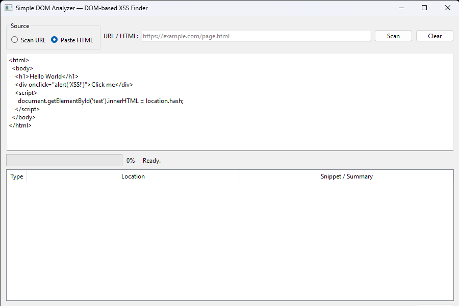

# Simple DOM Analyzer

**Simple DOM Analyzer** is a Python/PyQt6 desktop application that scans HTML or URLs for potential DOM-based XSS vulnerabilities. It detects:

- Inline `<script>` blocks
- HTML elements with `on*` event attributes (e.g., `onclick`, `onmouseover`)
- Suspicious JavaScript patterns often associated with DOM XSS (e.g., `innerHTML`, `document.write`, `eval`, `location.hash`)

The tool runs entirely locally, with no external execution of JavaScript. It's safe for testing **your own websites or test environments only**.

---

## Screenshot



---

## Features

- Scan a URL or pasted HTML
- Background scanning (GUI stays responsive)
- Results table with Type, Location, and Snippet
- Save results to JSON report
- Easy-to-use PyQt6 GUI
- Lightweight, single EXE build possible with icon

---

## Requirements

- Python 3.10+  
- PyQt6  
- requests  
- beautifulsoup4  
- lxml  

Install dependencies:

```bash
pip install PyQt6 requests beautifulsoup4 lxml

Usage

Run the GUI:

python Simple-DOM-Analyzer.py


Choose Scan URL or Paste HTML

Enter a URL or paste HTML code

Click Scan

View results in the table

Optionally, click Save Report to export findings to JSON

EXE Build (Optional)

To create a single-file Windows executable:

pip install pyinstaller
pyinstaller --onefile --windowed --icon=webico.ico Simple-DOM-Analyzer.py


Your EXE will appear in dist/Simple-DOM-Analyzer.exe.

Disclaimer

This tool is for educational purposes only. Do not scan websites without explicit permission. The developer is not responsible for misuse.

License

MIT License